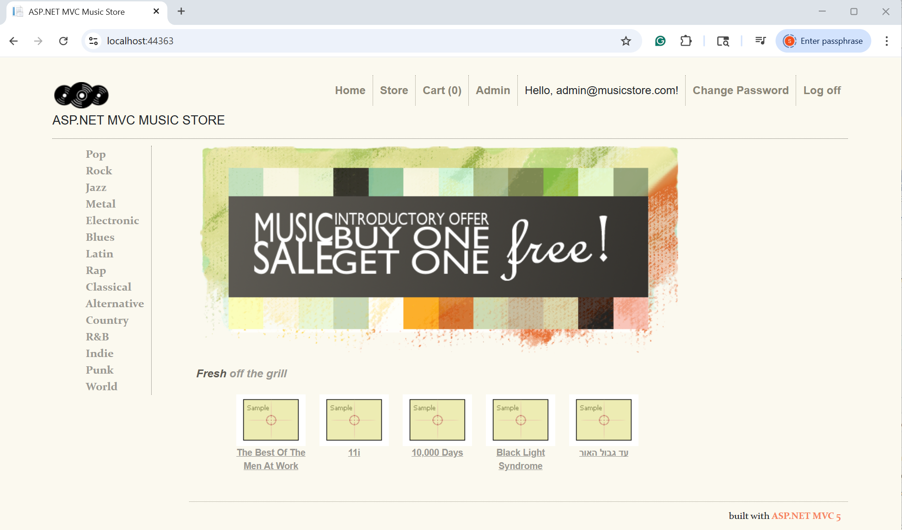

# MVC Music Store Migration

Enterprise migration portfolio demonstrating:

- **Platform Migration**: .NET Framework 4.8 → .NET 9 (7-phase risk-isolated strategy)
- **Cloud Architecture**: Azure App Service, SQL Database, Key Vault, Managed Identity
- **Testing Discipline**: Smoke tests, integration tests, performance baselines
- **Risk Management**: Separate infrastructure/platform/architecture changes across phases

**Current Status**: Phase 1 In Progress - Smoke Tests Complete ✅

## The Application

 *Phase 1: .NET Framework 4.8 baseline - [View smoke test results](docs/baselines/phase1-smoke-test-results-2025-11-28.md)*


Phase 4 will migrate this exact application to .NET 9 while preserving all functionality. Tests built now validate everything that follows.

## Tech Stack

**Current (Phase 1)**:

- .NET Framework 4.8 / ASP.NET MVC 5
- Entity Framework 6
- ASP.NET Identity 2.x
- LocalDB (SQL Server)
- Bootstrap 5
- jQuery / jQuery Validation

**Target (Phase 4+)**:

- .NET 9 / ASP.NET Core MVC
- Entity Framework Core 9
- ASP.NET Core Identity
- Azure SQL Database
- Azure App Service
- Azure Key Vault

## Why This Migration Matters

Most tutorials migrate toy apps. This project tackles real-world migration challenges:

- **Legacy Dependencies**: ASP.NET Identity 2.x, Entity Framework 6, System.Web.* namespaces
- **Breaking Changes**: MVC routing, middleware pipeline, configuration system all fundamentally different
- **Risk Management**: Can't rewrite - must preserve exact behavior while changing platform
- **Cloud-First**: Azure deployment before platform migration (isolate infrastructure and platform risks)

## Project Approach

This migration isolates three high-risk changes that typically happen together:

1. **Infrastructure** (Phases 2-3): Move to Azure while staying on .NET Framework 4.8
2. **Platform** (Phase 4): Migrate to .NET 9 after Azure deployment is proven
3. **Architecture** (Phases 5-7): Modernize auth, add APIs, implement observability

By separating these risks, each phase has clear validation criteria and rollback options. Tests built in Phase 1 validate everything that follows.

## What's Been Accomplished

### Phase 0: Planning & Setup ✅ (Completed Nov 24, 2025)

- Repository structure established (`/src`, `/docs`, `/infrastructure`)
- Migration roadmap with 7-phase strategy
- Dependency inventory documented
- Seed project installed and verified

### Phase 1: Foundation & Testing 🟡 (In Progress - Smoke Tests Complete Dec 4, 2025)

**Phase 1 Metrics**:

- **13 smoke test scenarios** covering all user workflows (Browse → Cart → Checkout → Admin)
- **2 blocking bugs resolved** before baseline (cart AJAX removal, checkout validation)
- **0 console errors** in final baseline
- **15 pages/views** documented for Phase 4 regression detection

**Testing Infrastructure**:

- Comprehensive smoke test procedure (repeatable test protocol)
- Test account strategy documented (admin + visitor roles)
- Baseline behavior captured for all pages
- Known limitations identified and preserved (seed project quirks)

**Blockers Resolved**:

1. **Shopping cart AJAX removal failed** - jQuery execution order issue
   - **Fix**: Moved script to `@section Scripts` (standard MVC pattern)
   - **Result**: Cart removal now works correctly with fadeOut animation
2. **Checkout validation not triggering** - jQuery validation loaded before jQuery core
   - **Fix**: Corrected script bundle order in `@section Scripts`
   - **Result**: Client-side validation now provides immediate feedback

**Baseline Documentation**:

- 13 pages tested and documented (Home, Store, Cart, Checkout, Admin, Auth, Error)
- Known limitations captured (non-critical UX quirks from seed project)
- Console output recorded (clean - no errors after fixes)
- Regression detection strategy established for Phase 4

**Key Deliverables**:

- [Smoke Test Procedure](docs/phases/phase-01/Smoke-Test-Procedure.md) - Repeatable test protocol
- [Phase 1 Baseline Results](docs/baselines/phase1-smoke-test-results-2025-11-28.md) - Complete baseline

## Key Decisions & Discoveries

**Baseline Strategy**: Fixed two script ordering bugs (AJAX cart removal, checkout validation) before documenting baseline. This decision means Phase 4 validates against "correct Framework 4.8 behavior" rather than "Framework 4.8 with bugs" - cleaner comparison, better regression detection.

**Scope Discipline**: Documented seed project UX quirks (non-clickable logo, narrow footer, missing hover states) as "preserve during migration" rather than fixing them. Platform migration is the goal, not UX renovation. This scoping prevents Phase 4 from expanding into a rewrite.

**Phase 4 Risk Identified**: The jQuery dependency chain issues discovered here will matter in Phase 4 - ASP.NET Core bundling is fundamentally different from Framework bundling. Script loading order that "just works" now will need explicit configuration.

## Running Locally

**Prerequisites**:

- Visual Studio 2022
- SQL Server LocalDB
- .NET Framework 4.8 SDK

**Steps**:

```bash
# Clone repository
git clone https://github.com/steveLeVesconte/dotnet48-to-dotnet9-mvc.git
cd dotnet48-to-dotnet9-mvc

# Open solution
start src/MvcMusicStore.sln

# Build and run (F5 in Visual Studio)
# Database will auto-create and seed on first run
```

**First-Time Setup**:

1. Application will auto-seed database with 462 albums, 15 genres, 303 artists

### Test Accounts

This is a **portfolio demonstration project** with publicly available source code.
These credentials are for local testing only and are documented here for convenience.

**Admin Account** (auto-created by seed data):
- Email: `admin@musicstore.com`
- Password: `Admin123!`

**Visitor Account** (create manually via `/Account/Register`):
- Email: `visitor@test.com`  
- Password: `Visitor@123456`

**Note**: In production environments, test credentials would be in Azure Key Vault 
or environment variables, never committed to source control. This project demonstrates
proper cloud secrets management in Phase 2 (Azure deployment) and Phase 5 
(Managed Identity integration).

**Verification**:

- Homepage should display 5 featured albums
- Genre navigation shows 15 genres with album counts
- Admin link in header navigates to `/StoreManager` (requires admin login)
- Cart and checkout workflows functional (see [smoke test procedure](docs/phases/phase-01/Smoke-Test-Procedure.md) for details)

## Testing

**Current Coverage** (Phase 1):

- Manual smoke tests: 13 scenarios covering all user workflows
- Test accounts documented with role-based access validation
- Baseline behavior captured for regression detection

**Phase 2 Targets**:

- Integration tests (8-12 scenarios): Browse → Cart → Checkout workflows
- Unit tests (60-70% coverage): Business logic and data access
- Performance baselines: Homepage, album details, checkout (5 runs each)

## Project Status

| Phase | Focus                              | Status              |
| ----- | ---------------------------------- | ------------------- |
| 0     | Planning & Setup                   | ✅ Complete (Nov 24) |
| 1     | Foundation & Testing               | 🟡 In Progress       |
| 2     | Azure Migration (Framework 4.8)    | ⚪ Not Started       |
| 3     | Azure Baseline & Validation        | ⚪ Not Started       |
| 4     | Platform Migration to .NET 9       | ⚪ Not Started       |
| 5     | Modern Auth & Azure Secrets        | ⚪ Not Started       |
| 6     | APIs & Event-Driven Architecture   | ⚪ Not Started       |
| 7     | Observability & Deployment Options | ⚪ Not Started       |

**Success Criteria**: Same smoke test results in Azure as localhost

## Architecture Decisions

Key architectural decisions documented as ADRs:

- [ADR-001: Why Isolate Infrastructure from Platform Migration](docs/architecture/001-phase-separation.md)
- [ADR-002: Why Test Framework 4.8 Before Migrating](docs/architecture/002-baseline-first.md)
- [ADR-003: Why Fix Bugs Before Baseline Documentation](docs/architecture/003-baseline-correctness.md)

## Documentation

- [Migration Roadmap](docs/roadmap.md) - Complete 7-phase strategy with timelines
- [Smoke Test Procedure](docs/phases/phase-01/Smoke-Test-Procedure.md) - Repeatable testing protocol
- [Phase 1 Baseline Results](docs/baselines/phase1-smoke-test-results-2025-11-28.md) - Behavior documentation

## Repository Structure

```
dotnet48-to-dotnet9-mvc/
├── src/                         # Source code
│   └── MvcMusicStore/           # Current .NET Framework 4.8 application
├── docs/                        # Documentation
│   ├── baselines/               # Baseline measurements and test results
│   ├── phases/                  # Detailed work plans per phase
│   └── architecture/            # Architecture decisions and diagrams
├── infrastructure/              # Azure Infrastructure as Code (coming in Phase 2)
└── tests/                       # Test projects (coming in Phase 2)
```

## License

This is a learning/portfolio project based on Microsoft's MVC Music Store tutorial. Original tutorial materials are Microsoft property. Implementation and migration work is my own.

## Acknowledgments

Based on [my MVC5 adaptation](https://github.com/steveLeVesconte/MvcMusicStore) of Microsoft's [MVC3 Music Store Tutorial](https://learn.microsoft.com/en-us/aspnet/mvc/overview/older-versions/mvc-music-store/mvc-music-store-part-1) - a classic ASP.NET MVC learning resource that demonstrates practical e-commerce patterns. The seed project is a clean-room MVC5 implementation of this tutorial, providing a realistic migration scenario.