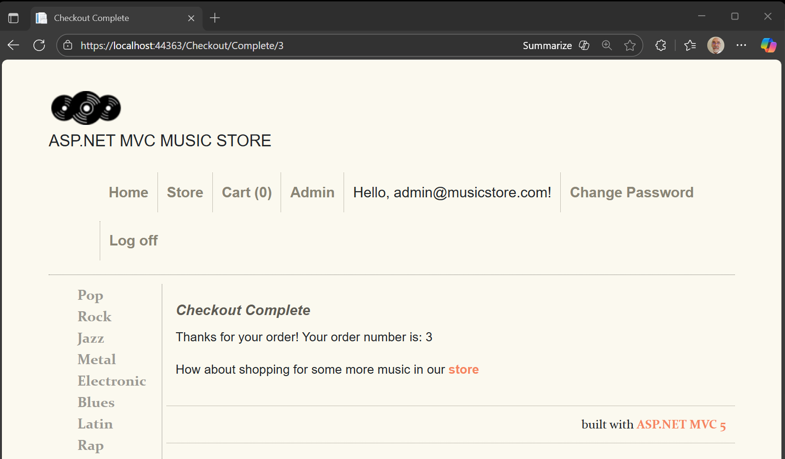

# Phase 00 — Seed Project Verification

### MvcMusicStore (.NET Framework 4.8)

This document verifies that the **MvcMusicStore** seed project builds, initializes its databases, and runs correctly on **.NET Framework 4.8**. This establishes the authoritative baseline for the migration to **ASP.NET Core (.NET 9)**.

------

## Objectives

- Confirm the project builds and runs cleanly under .NET Framework 4.8
- Validate **initial database creation** (MusicStore + Identity)
- Confirm ability to **log in** using default seeded credentials
- Capture a complete **end-to-end checkout flow**, including order confirmation
- Document the changes required to ensure **fresh database initialization**

------

## Environment

- **Project Location:** `/src/MvcMusicStore`
- **Framework:** .NET Framework **4.8**
- **IDE:** Visual Studio (IIS Express)
- **Base URL:** `https://localhost:44363`
- **Database Engine:** LocalDB `(LocalDb)\MSSQLLocalDB`

------

## Ensuring a Fresh Database Initialization

The project ships with EF Code First initialization logic.
 **However, initialization only triggers if the target databases do not already exist.**

To ensure a clean verification:

### 1. Two older LocalDB databases were present

- `MvcMusicStore`
- `MvcMusicStoreUsers`

These needed to be **replaced** to confirm that the initializers work and that all seed data is correct.

### 2. Connection strings were updated to point to new DB names

```
<connectionStrings>
  <add name="MusicStoreEntities"
       connectionString="Data Source=(LocalDb)\MSSQLLocalDB;Initial Catalog=MvcMusicStoreV3;Integrated Security=True"
       providerName="System.Data.SqlClient" />

  <add name="IdentityConnection"
       connectionString="Data Source=(LocalDb)\MSSQLLocalDB;Initial Catalog=MvcMusicStoreUsersV3;Integrated Security=True"
       providerName="System.Data.SqlClient" />
</connectionStrings>
```

This forced EF to create:

- **MvcMusicStoreV3** (application data)
- **MvcMusicStoreUsersV3** (identity & membership)

and guaranteed that the application’s initialization logic was executed.

### 3. Successful Initialization Verification

- Both databases were created automatically on first run
- Tables and seed data were correctly generated
- Identity DB contained the default admin user, allowing login

------

## Login Verification

After the new databases initialized:

1. Launched the application
2. Navigated to the **/Account/Login** page
3. Logged in using the seeded administrator account (from Identity initializer)
4. Confirmed:
   - Login succeeded
   - Auth cookie issued
   - Authenticated navigation elements appeared

This step validates the Identity initializer and ensures authentication is working under the fresh DB setup.

------

## Verification Workflow

1. **Cloned** the seed project into `/src/MvcMusicStore`
2. Updated connection strings to ensure fresh DB creation
3. **Restored NuGet packages**
4. **Built** the solution in Visual Studio
5. **Launched** the application via IIS Express
6. Executed smoke test:
   - Viewed album catalog
   - Added an album to shopping cart
   - Logged in using seeded admin credentials
   - Completed checkout
   - Reached order confirmation page

------

## Results Summary

| Checkpoint                                | Status |
| ----------------------------------------- | ------ |
| Fresh LocalDB databases created           | ✔️      |
| Admin login works with seeded credentials | ✔️      |
| Solution builds without errors            | ✔️      |
| Album catalog renders                     | ✔️      |
| Shopping cart operations work             | ✔️      |
| Checkout completes end-to-end             | ✔️      |
| Order confirmation page displays          | ✔️      |

------

## Screenshot (End-to-End Confirmation)

Order confirmation page demonstrating successful checkout flow under freshly initialized databases.



------

## Notes & Observations

- Changing DB names was required to validate seed initialization
- DB creation + seeding worked exactly as expected
- No browser console errors
- No server-side exceptions
- Application and identity flows confirmed healthy

------

## Status

**Phase 00 complete.**
 The project baseline is verified.
 Next step: **Phase 01 — Testing & Observability Foundation**.